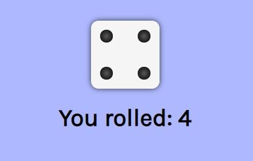

# Dice roll app

A very simple dice roll app built using CSS Grid.

See the live version [here](https://tasxatzial.github.io/css-dice).

## Run locally

Download the 'src' folder and open 'index.html' in the browser.
